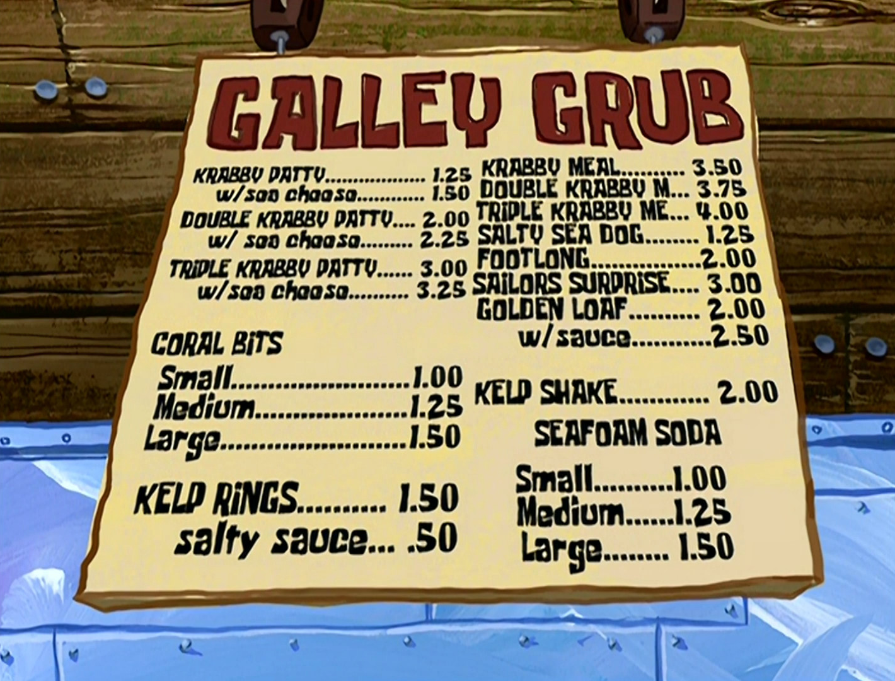
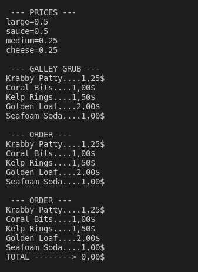
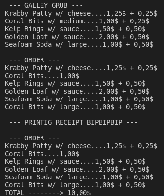
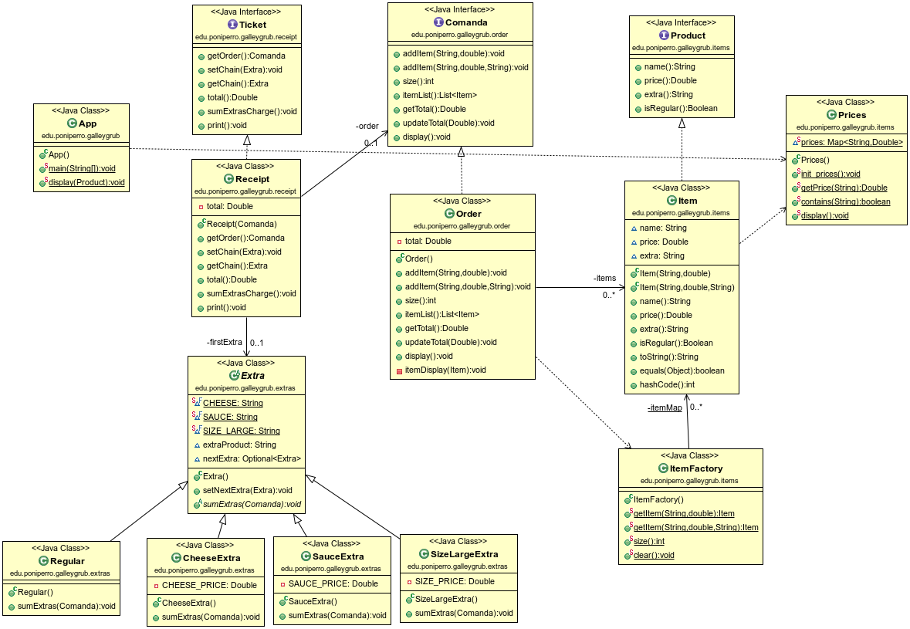

GALLEY GRUB
===========
Extraído del repo [galley-grub](https://github.com/dfleta/galley-grub) de [@dfleta](https://github.com/dfleta)

Bob Esponja trabaja como cocinero en el Krusty Krab, restaurante famoso por su hamburguesa de autor Krabby Patty.

El restaurante tiene un menu llamado Galley Grub que puedes leer aquí:

https://spongebob.fandom.com/wiki/Galley_Grub

Las comandas son anotadas a mano por Squidward Tentacles.

El propierario Eugene H. Krabs -un agarrao- en vez de adquirir un TPV ha decidido contratar a un estudiante  para  construir un software que calcule el importe total del pedido e imprimir el recibo.

Intenta hacer como que programas si no quieres terminar en la cocina ayudando a Bob a preparar Krusty Burguers.

Implementa las historias de usuario con la lógica descrita en el `main` de la clase principal `App.java`.

Si tienes dudas, puedes observar las historias de usuario _live_ en el capítulo _Pickles_ aquí:

https://www.youtube.com/watch?v=VlxSEEIwwNY&list=PL_181YA7nAlfR_0ro3l6Dh7ReB7AB7Mon

## Salida de la aplicación

Intenta que la salida del programa por CLI sea lo más parecida posible a las imágenes que se proporcionan. Cada una de ellas se corresponde con una de las historias de usuario que se detallan en los epígrafes siguientes.

## Diagrama de clases UML / Arquitectura de la app.

Sigue el diagrama de clase UML proporcionado para construir la aplicación.
Si añades algún componente, dibújalo a mano alzada sobre el diagrama.

*La clase Prices se plantea como un Enum en la última versión del programa, aunque se mantienen los métodos con la misma funcionalidad para no romper la interfaz.

